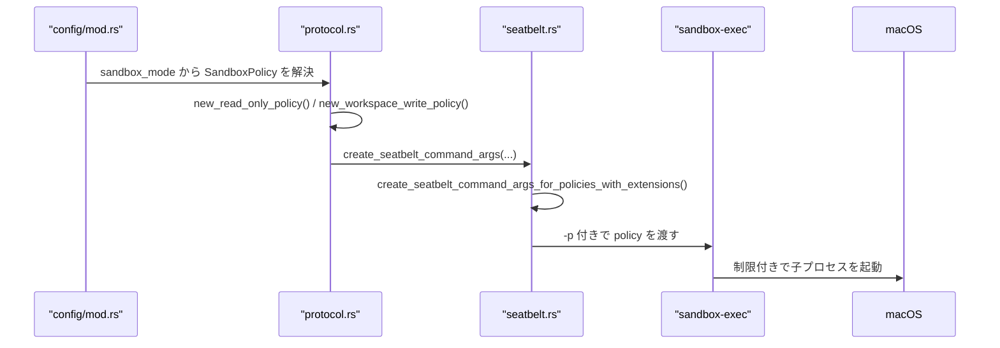
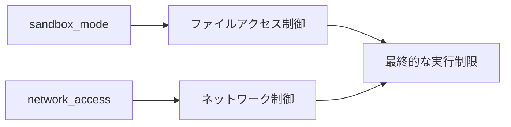

## はじめに

`Codex`内臓のサンドボックス機能がセキュリティ的な観点で過不足ないか気になり、調査しました。
前提として公式ドキュメントでは、macOS ではサンドボックス機能として Seatbelt を用い、追加の仕組みなしで（out of the box）sandboxing が動作すると説明されている。別ページでは、Seatbelt のポリシーに基づき `sandbox-exec` でコマンドを実行し、`-p` に渡すプロファイルは `--sandbox` で選んだモードに対応すると、1段階踏み込んだ説明がある。

これらの記述から読み取れるのは、Codex が macOS 上で Seatbelt のポリシーを組み立て、`sandbox-exec` の `-p` にそのプロファイルを渡してコマンドを実行している、という点である。以降では、この前提を踏まえて Seatbelt の位置づけ、`sandbox-exec` の役割、設定上の `sandbox_mode` がどのように権限境界に反映されるかを順に見ていく。

公式の原文は次のとおりである。

> On **macOS**, sandboxing works out of the box using the built-in Seatbelt framework.
> 引用元: [Sandboxing](https://developers.openai.com/codex/concepts/sandboxing/)

> macOS uses Seatbelt policies and runs commands using sandbox-exec with a profile (-p) that corresponds to the --sandbox mode you selected.
> 引用元: [Agent approvals & security](https://developers.openai.com/codex/agent-approvals-security#os-level-sandbox)

## Seatbelt とは

- macOS が提供する OS レベルの機能
- 制限の対象は Codex 本体のファイル操作にとどまらず、Codex が起動する `git` やテストコマンドなどの子プロセスにも及ぶ
- 制限の中身は `--sandbox`（設定上は `sandbox_mode` に相当）のモードごとに変わる

したがって、「`sandbox_mode` を切り替えると、Codex が実際に実行するコマンドの権限境界もそれに応じて変わる」と考えれば問題ないです。

※ Appleの公式ドキュメントを探したが、筆者の調べた範囲では見当たらなかった

## `sandbox-exec` とは

`sandbox-exec` は、Seatbelt ポリシーを指定してコマンドを実行する macOS の仕組みです。例えば次のように使います。

```bash
# 基本構文
sandbox-exec -p '<policy>' <command>

# 読み取りのみ許可する例
sandbox-exec -p '(version 1) (deny default) (allow file-read*)' cat README.md

# 書き込みは禁止される例
sandbox-exec -p '(version 1) (deny default) (allow file-read*)' touch example.txt
```

この例では、`cat README.md` の実行は成功しますが、書き込み権限がないため `touch example.txt` の実行は失敗します。

このように `sandbox-exec` に与えるポリシーによって、許可された操作だけを OS レベルで通し、それ以外は拒否できます。

## `sandbox_mode` とは

### 動的にかかる OS レベルの実行制限

`sandbox_mode` は、Codex が起動する子プロセスにどの程度の権限を与えるかを決める設定である。

ここで誤解しやすいのは、IDE や CLI 本体の App Sandbox を切り替える話ではない、という点である。実際に変わるのは、コマンド実行のたびに適用される OS レベルの制限である。つまり `sandbox_mode` を変えると、Codex プロセスそのものというより、Codex が実行するコマンドの権限境界が変わる。

## `sandbox_mode` の3つのモード

代表的なモードは次の三つである。

| モード | 概要 |
| --- | --- |
| `read-only` | 読み取り中心。通常の書き込みは許可しない。 |
| `workspace-write` | ワークスペース周辺に限って書き込みを許可する。 |
| `danger-full-access` | 制限を大きく緩め、広いアクセスを許可する。 |

## プロファイルはどう決まるか

:::message alert
この節は Codex が[コードベース](https://github.com/openai/codex)で調査した内容を元に記載しています。関数名やシーケンス図などにハルシネーション（誤生成）が含まれる可能性があります。公式ドキュメントやソースコード等で内容を精査した上で参照してください。
:::


プロファイルは、あらかじめ名前の決まったファイルを1つ選ぶのではなく、`sandbox_mode` に応じて実行時に決まる。



押さえておきたいのは、「`sandbox_mode` が文字列としてそのままカーネルに渡るわけではなく、macOS が解釈できる実行制限へと変換されてから適用される」ということです。

実装上、この流れに関わる主な関数の役割は次のとおりである（ファイル名・関数名は Codex のソース構成に基づく）。

| 関数 | 役割 |
| --- | --- |
| `new_read_only_policy()` | `read-only` 用の `SandboxPolicy` を構築する。 |
| `new_workspace_write_policy()` | `workspace-write` 用の `SandboxPolicy` を構築する。 |
| `has_full_disk_read_access()` | ディスク全体の読み取りを許可として扱うかを判定する。 |
| `has_full_disk_write_access()` | ディスク全体の書き込みを許可として扱うかを判定する。 |
| `has_full_network_access()` | ネットワークを許可するかを判定する。 |
| `get_readable_roots_with_cwd()` | 読み取り対象のルートを計算する。 |
| `get_writable_roots_with_cwd()` | 書き込み対象のルートを計算する。 |
| `create_seatbelt_command_args(...)` | `SandboxPolicy` から `sandbox-exec` に渡す引数を組み立てる。 |
| `create_seatbelt_command_args_for_policies_with_extensions()` | ファイルの読み書きやネットワークなどの断片をまとめ、最終的なポリシー文字列を組み立てる。 |

### ざっくりとした理解


筆者がAIによる調査結果をもとにまとめると、`sandbox_mode`の値に応じてSBPLファイルが動的に生成・選択され、`sandbox-exec`を通じてOSレベルの実行コマンドが制御される仕組みになっている。

:::message
[codex-rs/sandboxing/src](https://github.com/openai/codex/tree/e65ee385793bf0b82cc958b9fc5081f81110706b/codex-rs/sandboxing/src) ディレクトリにSBPLファイルが定義されている
:::

## ネットワーク制御は別軸で重なる

`sandbox_mode` は主にファイルアクセスの境界を表す一方で、ネットワークの可否は別の設定軸と組み合わさる。



そのため、`read-only` や `workspace-write` を整理するときは、ファイルとネットワークを分けて考えると分かりやすい。

## まとめ

Codexの`sandbox_mode`は、macOS上で子プロセスを実行する際の権限範囲を制御するための設定で「どのリソースに対し、どの操作を許可・拒否するか」というポリシーを宣言的に指定する方式のため、「Agentが必ず`.env`ファイルを読み込めないようにする」といった厳格な禁止までは仕組み上できません。

サプライチェーン攻撃（例: [axios の事例](https://www.trendmicro.com/ja_jp/research/26/d/axios-npm-package-compromised.html)）に加え、`rg` や `cat` といったコマンドを経由して、Agent が個人情報やセキュリティ上の影響の大きいファイルの内容を外部へ送信してしまうリスクもあります。現代の開発現場では、macOS 標準のサンドボックス機能のみではセキュリティ対策として十分とは言えず、追加の対策や注意が必要だと考えます。
